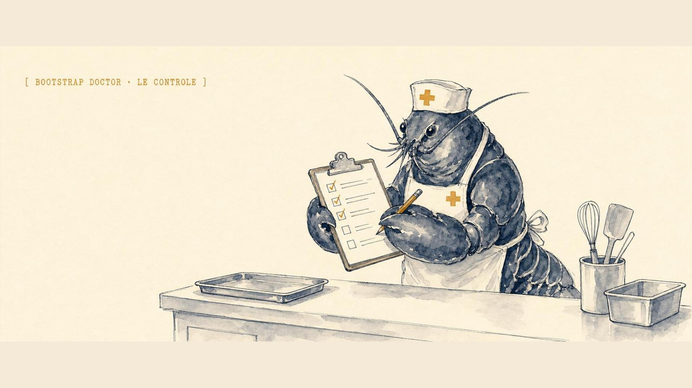
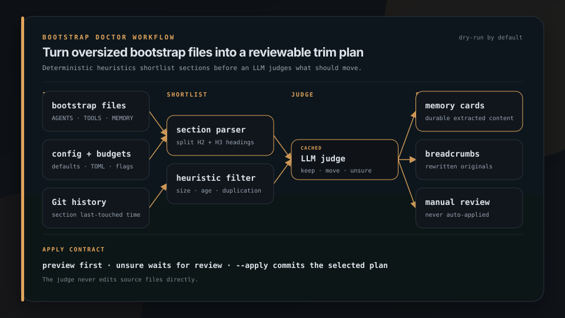

<p align="center">
  
</p>

<h1 align="center">Bootstrap Doctor</h1>

<p align="center">
  
</p>

<p align="center">
  <strong>Oversized bootstrap files silently truncate. Doctor trims them before the session starts broken.</strong>
</p>

<p align="center">
  Audit and trim OpenClaw (and similar) bootstrap files against soft and hard char limits. Heuristics plus optional LLM judgment. Dry-run first.
</p>

<p align="center">
  <a href="https://brigade.tools/bootstrap-doctor">Website</a> &middot; <a href="#install">Install</a>
</p>

<p align="center">
  
  
</p>

## Install

```bash
pipx install git+https://github.com/escoffier-labs/bootstrap-doctor
bootstrap-doctor status
bootstrap-doctor lint
bootstrap-doctor audit
bootstrap-doctor trim
```

## What it does

| | Job | What you get |
|---|---|---|
| **Measure** | Every bootstrap surface | Size vs soft and hard limits |
| **Lint** | Stale lifecycle and leftover context | Seven stable finding IDs; read-only |
| **Audit** | What should move out | Heuristic shortlist; optional LLM judge |
| **Trim** | Reference cards, not silent cut | Dry-run plan first; --apply after review |


## Usage

### status

```
$ bootstrap-doctor status
bootstrap-doctor status  (soft=17000, hard=20000, total=60000)

workspace  /home/you/.openclaw/workspace
  file          chars  lines    soft    hard  sev
  AGENTS.md     14643    185   +2357   +5357  ok
  TOOLS.md      11409    221   +5591   +8591  ok
  BOOTSTRAP.md      -      -       -       -  OPTIONAL
  total: 49307/60000 (+10693 remaining, ok, complete)
```

Use `--json` for machine-readable output with per-file limits, the 60,000-character workspace limit, per-workspace totals, and one row per tracked file. Character counts use OpenClaw's injected representation: trailing whitespace is removed and JavaScript UTF-16 code units are counted.

### runtime

`status` measures files on disk. That is a proxy, and the proxy can be green while the model receives nothing. `runtime` reads OpenClaw's `context.compiled` trajectory event, which records the exact system prompt that was sent, and checks the tracked files against it.

```
$ bootstrap-doctor runtime
bootstrap-doctor runtime  (agent=main)

effective caps from /home/you/.openclaw/openclaw.json
  per-file  40000 (configured)
  total     120000 (configured)
  DRIFT total budget: OpenClaw will apply 120000, bootstrap-doctor is configured for 60000

newest compiled prompt  2026-08-13T12:13:26.294Z
  trace   /home/you/.openclaw/agents/main/sessions/c263c3f5.trajectory.jsonl
  session agent:main:telegram:direct:123
  model   grok-4.6
  chars   20000
  skipped 6067 cron/heartbeat compile(s), which carry no bootstrap files by design

  file             disk  injected  status
  AGENTS.md       15280         -  ABSENT
  SOUL.md          5098       807  TRUNCATED
  TOOLS.md        12896     14550  ok

summary: 2 tracked file(s) missing from the prompt, 1 truncated, 2 cap drift note(s)
  AGENTS.md ... never reached the model. Raise agents.defaults.bootstrapTotalMaxChars or shrink earlier files.
```

Exit codes follow the usual contract: `0` everything arrived, `1` something was truncated or the caps drifted, `2` a tracked file never reached the model.

If the session ran on a harness runtime that delivers bootstrap through its own channels, the Codex runtime being the case that exists today, the verb says so and reports `UNKNOWN` rather than guessing. Codex receives AGENTS.md as native project-doc `<INSTRUCTIONS>` and mirrors the bootstrap set into `world_state`, so its `context.compiled` system prompt holds only the OpenClaw-side preamble and is not evidence either way.

Two more notes on reading the output. `optional` excuses a file that is not on disk, never one that is on disk and failed to arrive. And when a prompt exceeds the 32,768-character trajectory field limit, OpenClaw records only its size, so the verb reports the size and says plainly that per-file presence could not be verified rather than guessing.

Scope with `--agent`, `--session-key`, `--openclaw-home`, and `--openclaw-config`. Cron and heartbeat sessions are excluded by default and the skipped count is always printed.

### lint

`status` measures size. `lint` checks whether a workspace still looks like first-run setup after it has already been used, and whether leftover workspaces or duplicated bootstrap files are still sitting around.

```
$ bootstrap-doctor lint
bootstrap-doctor lint
error  bootstrap-after-setup  /home/you/.openclaw/workspace/BOOTSTRAP.md  agent=main
  BOOTSTRAP.md remains after setupCompletedAt
warning  configured-placeholder  /home/you/.openclaw/workspace/IDENTITY.md  agent=main
  IDENTITY.md retains stock or blank placeholder fields

summary: 1 error(s), 1 warning(s)
```

Read-only. No LLM, no writes, no OpenClaw subprocess. Discovery stays bounded: the primary workspace, configured named workspaces, sibling `workspace-*` directories, and immediate child workspaces. Backup, docs, worktree, dependency, cache, and Git paths are ignored.

Stable finding IDs:

- `bootstrap-after-setup` - error when `BOOTSTRAP.md` remains after `setupCompletedAt`.
- `orphan-workspace` - warning when an unconfigured workspace retains `BOOTSTRAP.md`.
- `configured-placeholder` - warning when a configured agent retains stock or blank `IDENTITY.md` or `USER.md` fields.
- `memory-contradicts-fresh` - error when `BOOTSTRAP.md` claims first-run state but the workspace already contains substantive memory.
- `inactive-context-content` - warning when a substantive recognized bootstrap file is present but excluded from the configured tracked-file set.
- `dangling-agent-reference` - error when `subagents.allowAgents` names an agent absent from `agents.list`; `*` remains valid.
- `duplicate-context` - warning for exact normalized duplicate bootstrap content of at least 200 characters across configured workspaces. `BOOTSTRAP.md` is excluded. Stock placeholder `IDENTITY.md` and `USER.md` templates are skipped; filled or custom copies still count.

`--json` prints a stable object with `ok`, `findings`, `error_count`, and `warning_count`. Each finding has `check_id`, `severity`, `message`, `path`, and `agent_id`. `agent_id` is `null` when no agent owns the finding.

Exit codes: `0` clean, `1` warning-only findings, `2` any error or unreadable/invalid `openclaw.json`.

`--openclaw-home` defaults to `~/.openclaw` and supplies the default config path (`~/.openclaw/openclaw.json`). `--openclaw-config` overrides that file explicitly.

### audit

```
$ bootstrap-doctor audit
workspace   file            heading                       chars  reasons                 decision  topic / reasoning
workspace   TOOLS.md        Postiz API endpoints            412  large                   move      Postiz API endpoints
workspace   TOOLS.md        Eero device culling             186  stale                   keep      active operating rule
workspace   AGENTS.md       codex-builder agent gotchas     533  large, stale            unsure    needs operator review

stats: gateway_requests=3  cache_hits=0  failures=0
```

No writes. Verdicts cached by content hash so re-runs are cheap; pass `--no-cache` to bypass the cache for that run.

### trim

```
$ bootstrap-doctor trim
DRY-RUN. Would write:
  memory/cards/postiz-api-endpoints.md       (+412 lines)
  memory/cards/jellyfin-tool-patterns.md     (+58 lines)
Would modify:
  TOOLS.md  -73 lines  (11,589 -> 8,402 chars)

Pass --apply to commit.
```

```
$ bootstrap-doctor trim --apply
```

`unsure` verdicts are never auto-applied. They show up in audit output for manual review.

## How it works

<p align="center">
  
</p>

<p align="center"><em>Heuristics shortlist sections before the judge can recommend a move.</em></p>

bootstrap-doctor runs a four-stage pipeline.

1. **Section parser.** Splits each tracked `.md` by H2/H3 headings into `(file, heading_path, body, char_count, last_touched_git_mtime)` tuples.
2. **Heuristic shortlist.** Flags sections that look offload-worthy: body > 400 chars, contains a code block > 10 lines, no git touch in 60+ days, or duplicated across multiple tracked files.
3. **LLM judge.** For each shortlisted section, POSTs to an OpenAI-compatible chat-completions endpoint (default `http://localhost:11434`, Ollama) with a structured prompt asking whether the section is *must-stay-loaded* (active rules, identity, currently-relevant state) or *reference-detail* (historical, exemplar, one-off setup). Verdict is one of `keep`, `move`, or `unsure`. Token budget capped per run; verdicts cached by SHA256 of section body in `~/.cache/bootstrap-doctor/verdicts.json`. Any OpenAI-compatible endpoint works (Ollama, OpenAI, vLLM, etc.); set `gateway_url` and `gateway_model` in config.
4. **Trim plan.** For each `move` verdict, writes a card to `memory/cards/<slug>.md` with the existing frontmatter convention, replaces the section in the original with a one-line breadcrumb pointing at the card. `keep` is a no-op. `unsure` is reported but never auto-applied.

## Config

`~/.config/bootstrap-doctor/config.toml`:

```toml
workspace_dir = "~/.openclaw/workspace"
cards_dir = "~/.openclaw/workspace/memory/cards"
gateway_url = "http://localhost:11434"
gateway_model = "deepseek-v4-pro:cloud"
soft_limit = 17000
hard_limit = 20000
total_limit = 60000
tracked_files = [
  "AGENTS.md", "SOUL.md", "TOOLS.md", "IDENTITY.md",
  "USER.md", "HEARTBEAT.md", "BOOTSTRAP.md", "MEMORY.md",
]
named_workspaces = ["workspace-claude", "workspace-main", "workspace-researcher"]

[heuristics]
min_section_chars = 400
stale_days = 60
```

Layering: built-in defaults, then config file, then env vars, then CLI flags.

Path-like values must be non-empty strings without control characters or leading/trailing whitespace. `tracked_files` and `named_workspaces` must be unique local names, not paths. Missing `SOUL.md`, `IDENTITY.md`, `USER.md`, `HEARTBEAT.md`, `BOOTSTRAP.md`, and `MEMORY.md` are optional because OpenClaw may omit them after setup or when long-term memory is disabled. Other configured files are required.

## Safety

- Dry-run by default. `--apply` required for any write.
- Atomic writes: temp file plus rename, so a torn write cannot leave a half-rewritten bootstrap file.
- Path-traversal guard on card slugs (must resolve inside `cards_dir`).
- Refuses to run if `git status` in the workspace is dirty, so any change is revertable. If `cards_dir` lives in a separate git repo, that repo must be clean too. Override with `--force`.
- Verdict cache is local-only (`~/.cache/bootstrap-doctor/verdicts.json`). Bypass it for one run with `--no-cache`.
- Card-write failures abort before bootstrap files are rewritten, so a failed run cannot leave breadcrumbs pointing at missing cards.

## Why not something else?

- **A manual eyeball-and-copy pass** is the status quo: notice a file is too big, read a section, copy it to `memory/cards/`, leave a breadcrumb by hand. It gets skipped under load, and the file you miss is the one that truncates. bootstrap-doctor automates the audit-and-relocate loop and stays dry-run so you can review the plan first.
- **A generic markdown or prose linter** measures readability, not the OpenClaw session-prefix budget. It does not know which files load every turn, where the soft/hard ceilings sit, or which sections are active rules versus reference detail. bootstrap-doctor is built around exactly those limits and that keep/move distinction.
- **`wc -c` plus a script** tells you a file is over budget but not *what* to move. The judgement of must-stay-loaded versus reference-detail is the hard part, which is why bootstrap-doctor pairs heuristics with an LLM verdict instead of a raw size cutoff.
- **A hosted memory or context service** would mean shipping your bootstrap files off the machine. bootstrap-doctor reads and rewrites local files only; the one optional network call is to an LLM gateway you configure and point wherever you trust.

## What bootstrap-doctor is not

bootstrap-doctor is not a memory manager, a context-compression engine, or an OpenClaw replacement. It checks OpenClaw's default 20,000-character per-file and 60,000-character total budgets, then helps relocate reference detail into cards. OpenClaw's native doctor remains authoritative for generated hook content and runtime-specific injection.

It does not:

- summarize, rewrite, or compress your content (a moved section is copied verbatim into a card)
- decide anything for you on `unsure` verdicts (those are reported, never auto-applied)
- write anything without `--apply` (every verb is dry-run or read-only by default)
- run in the background, on a schedule, or as a daemon (you run it when you want it)
- touch files outside the workspace or `cards_dir` (slug traversal is guarded, writes are atomic)
- send your files anywhere except the LLM gateway you explicitly configure for `audit`

## Development

```bash
python3 -m pip install -e ".[dev]"
pytest -q
python3 -m ruff check .
python3 -m mypy src/bootstrap_doctor
python3 -m build
pip-audit . --skip-editable
```

## License

MIT. See [LICENSE](LICENSE).
