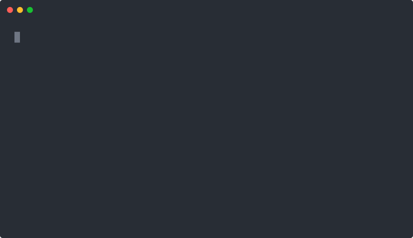
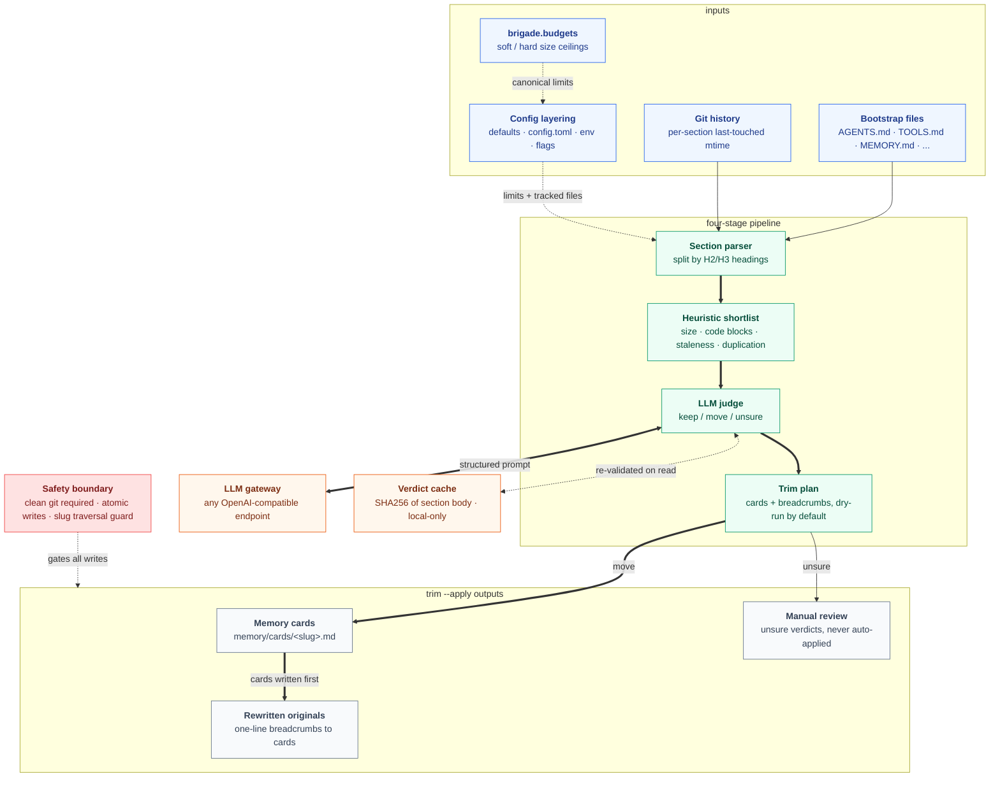

<p align="center">
  
</p>

<h1 align="center">bootstrap-doctor</h1>

<p align="center">
  <strong>A CLI that audits and trims the OpenClaw bootstrap files that load into every session prefix, before one silently truncates mid-session and drops your context with no error.</strong>
</p>

<p align="center">
  
  
  
  
</p>

<p align="center">
  <a href="https://bootstrap-doctor.escoffierlabs.dev"><strong>Website</strong></a>
  ·
  <a href="https://pypi.org/project/bootstrap-doctor/">PyPI</a>
  ·
  <a href="#install">Install</a>
  ·
  <a href="#how-it-works">How it works</a>
</p>

bootstrap-doctor is a bootstrap-file doctor for OpenClaw: it audits the markdown files that get loaded into every session prefix, flags sections that should move out, and rewrites the originals with one-line breadcrumbs to the relocated content. It exists because those files brush an empirical ~12,000-char ceiling where content gets silently truncated mid-session, dropping bootstrap context with no error. Unlike a manual eyeball-and-copy pass or a generic linter, it ranks oversize sections with heuristics plus an LLM keep/move verdict, relocates the detail into `memory/cards/`, and stays dry-run by default so it never loses content.

## What it does

bootstrap-doctor keeps OpenClaw bootstrap files (`AGENTS.md`, `TOOLS.md`, `SOUL.md`, `USER.md`, `SAFETY_RULES.md`, `IDENTITY.md`, `HEARTBEAT.md`, `MEMORY.md`) under the session-prefix size budget. These files load into the prefix on every turn, and there is an empirical soft ceiling around 12,000 chars per file before content gets silently truncated, dropping bootstrap context with no error. bootstrap-doctor audits each tracked file, scores oversize sections, and relocates the reference-detail ones into memory cards with a breadcrumb left behind, so originals stay short and nothing is lost.

Three subcommands, dry-run by default:

```
bootstrap-doctor status              # read-only summary of every tracked file
bootstrap-doctor audit               # heuristic shortlist plus LLM verdicts (keep / move / unsure)
bootstrap-doctor trim [--apply]      # apply the audit plan: write cards, replace sections with breadcrumbs
```

`status` and `audit` are read-only. They can run even if `cards_dir` does not exist yet. `trim` defaults to dry-run; pass `--apply` to actually write.

<p align="center">
  
</p>

`status` reports every tracked file against the soft and hard limits in one read-only pass, so the file about to silently truncate your session prefix (here, an oversized `SOUL.md`) is obvious before it bites.

## Install

From PyPI:

```bash
pipx install bootstrap-doctor
```

From a local clone:

```bash
git clone https://github.com/escoffier-labs/bootstrap-doctor
cd bootstrap-doctor
pipx install -e .
```

Requires Python 3.11+. Runtime dep: `requests` (used by the gateway client).

The bootstrap size limits (soft / hard / ceiling) are owned by [`brigade`](https://github.com/escoffier-labs/brigade) via `brigade.budgets`. bootstrap-doctor ships a mirrored fallback so it runs standalone without brigade installed. To source the limits from brigade directly and stay in lockstep with the rest of the tooling, install the optional extra:

```bash
pipx install "bootstrap-doctor[brigade]"
```

## Usage

### status

```
$ bootstrap-doctor status
workspace: /home/you/.openclaw/workspace
  AGENTS.md         11,805 chars   185 lines   OVER soft (10,000)
  TOOLS.md          11,589 chars   221 lines   OVER soft (10,000)
  SOUL.md            8,373 chars   124 lines   ok
  SAFETY_RULES.md    7,658 chars   118 lines   ok
  USER.md            7,229 chars    96 lines   ok
  IDENTITY.md        3,402 chars    52 lines   ok
  HEARTBEAT.md       2,109 chars    34 lines   ok
  MEMORY.md         15,720 chars   192 lines   OVER hard (11,500)
```

Use `--json` for machine-readable output with `soft_limit`, `hard_limit`, and one row per tracked file.

### audit

```
$ bootstrap-doctor audit
TOOLS.md
  ## Postiz API endpoints          [move]  -> postiz-api-endpoints.md
  ## Eero device culling            [keep]
  ## Jellyfin tool patterns         [move]  -> jellyfin-tool-patterns.md
AGENTS.md
  ## codex-builder agent gotchas    [unsure]
  ## ACPX-routed agent pinning      [move]  -> acpx-routed-agent-pinning.md
```

No writes. Verdicts cached by content hash so re-runs are cheap; pass `--no-cache` to force re-judgement.

### trim

```
$ bootstrap-doctor trim
DRY-RUN. Would write:
  memory/cards/postiz-api-endpoints.md       (+412 lines)
  memory/cards/jellyfin-tool-patterns.md     (+58 lines)
Would modify:
  TOOLS.md  -73 lines  (11,589 -> 8,402 chars)

Pass --apply to commit.
```

```
$ bootstrap-doctor trim --apply
```

`unsure` verdicts are never auto-applied. They show up in audit output for manual review.

## Config

`~/.config/bootstrap-doctor/config.toml`:

```toml
workspace_dir = "~/.openclaw/workspace"
cards_dir = "~/.openclaw/workspace/memory/cards"
gateway_url = "http://localhost:11434"
gateway_model = "deepseek-v4-pro:cloud"
soft_limit = 10000
hard_limit = 11500
tracked_files = [
  "AGENTS.md", "TOOLS.md", "SOUL.md", "USER.md",
  "SAFETY_RULES.md", "IDENTITY.md", "HEARTBEAT.md", "MEMORY.md",
]
named_workspaces = ["workspace-claude", "workspace-main", "workspace-researcher"]

[heuristics]
min_section_chars = 400
stale_days = 60
```

Layering: built-in defaults, then config file, then env vars, then CLI flags.

Path-like values must be non-empty strings without control characters or leading/trailing whitespace. `tracked_files` and `named_workspaces` must be local names, not paths.

## How it works



bootstrap-doctor runs a four-stage pipeline.

1. **Section parser.** Splits each tracked `.md` by H2/H3 headings into `(file, heading_path, body, char_count, last_touched_git_mtime)` tuples.
2. **Heuristic shortlist.** Flags sections that look offload-worthy: body > 400 chars, contains a code block > 10 lines, no git touch in 60+ days, or duplicated across multiple tracked files.
3. **LLM judge.** For each shortlisted section, POSTs to an OpenAI-compatible chat-completions endpoint (default `http://localhost:11434`, Ollama) with a structured prompt asking whether the section is *must-stay-loaded* (active rules, identity, currently-relevant state) or *reference-detail* (historical, exemplar, one-off setup). Verdict is one of `keep`, `move`, or `unsure`. Token budget capped per run; verdicts cached by SHA256 of section body in `~/.cache/bootstrap-doctor/verdicts.json`. Any OpenAI-compatible endpoint works (Ollama, OpenAI, vLLM, etc.); set `gateway_url` and `gateway_model` in config.
4. **Trim plan.** For each `move` verdict, writes a card to `memory/cards/<slug>.md` with the existing frontmatter convention, replaces the section in the original with a one-line breadcrumb pointing at the card. `keep` is a no-op. `unsure` is reported but never auto-applied.

## Safety

- Dry-run by default. `--apply` required for any write.
- Atomic writes: temp file plus rename, so a torn write cannot leave a half-rewritten bootstrap file.
- Path-traversal guard on card slugs (must resolve inside `cards_dir`).
- Refuses to run if `git status` in the workspace is dirty, so any change is revertable. If `cards_dir` lives in a separate git repo, that repo must be clean too. Override with `--force`.
- Verdict cache is local-only (`~/.cache/bootstrap-doctor/verdicts.json`). Clear with `--no-cache`.
- Card-write failures abort before bootstrap files are rewritten, so a failed run cannot leave breadcrumbs pointing at missing cards.

## Why not something else?

- **A manual eyeball-and-copy pass** is the status quo: notice a file is too big, read a section, copy it to `memory/cards/`, leave a breadcrumb by hand. It gets skipped under load, and the file you miss is the one that truncates. bootstrap-doctor automates the audit-and-relocate loop and stays dry-run so you can review the plan first.
- **A generic markdown or prose linter** measures readability, not the OpenClaw session-prefix budget. It does not know which files load every turn, where the soft/hard ceilings sit, or which sections are active rules versus reference detail. bootstrap-doctor is built around exactly those limits and that keep/move distinction.
- **`wc -c` plus a script** tells you a file is over budget but not *what* to move. The judgement of must-stay-loaded versus reference-detail is the hard part, which is why bootstrap-doctor pairs heuristics with an LLM verdict instead of a raw size cutoff.
- **A hosted memory or context service** would mean shipping your bootstrap files off the machine. bootstrap-doctor reads and rewrites local files only; the one optional network call is to an LLM gateway you configure and point wherever you trust.

## What bootstrap-doctor is not

bootstrap-doctor is not a memory manager, a context-compression engine, or an OpenClaw replacement. It does one thing: keep bootstrap files under the prefix budget by relocating reference detail into cards.

It does not:

- summarize, rewrite, or compress your content (a moved section is copied verbatim into a card)
- decide anything for you on `unsure` verdicts (those are reported, never auto-applied)
- write anything without `--apply` (every verb is dry-run or read-only by default)
- run in the background, on a schedule, or as a daemon (you run it when you want it)
- touch files outside the workspace or `cards_dir` (slug traversal is guarded, writes are atomic)
- send your files anywhere except the LLM gateway you explicitly configure for `audit`

## Development

```bash
python3 -m pip install -e ".[dev]"
pytest -q
python3 -m ruff check .
python3 -m mypy src/bootstrap_doctor
python3 -m build
pip-audit . --skip-editable
```

## License

MIT. See [LICENSE](LICENSE).
